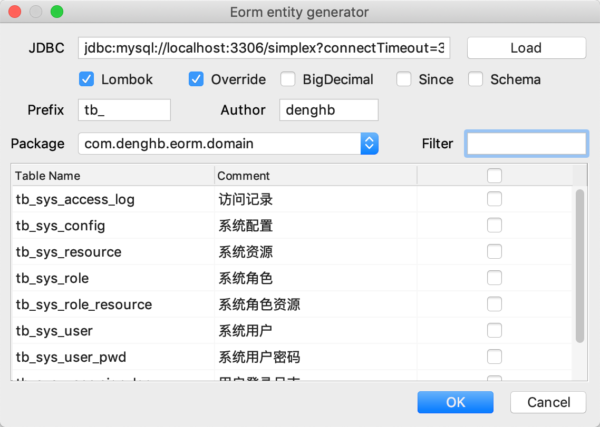

## eorm-spring

这是一个基于Spring `JdbcTemplate` 和 `NamedParameterJdbcTemplate` 的ORM框架。

Ta的前身是[dbhelper](https://github.com/deng-hb/dbhelper)，项目需要`spring 3.x`以上版本，还依赖项目[multi-line](https://github.com/deng-hb/multi-line)一个Java多行文本支持类。

### Maven依赖
```xml
<dependency>
    <groupId>com.denghb</groupId>
    <artifactId>eorm-spring</artifactId>
    <version>1.1.2</version>
</dependency>
```

### 配置
```java
@Autowired
private JdbcTemplate jdbcTemplate;

@Bean
public Eorm eorm() {
    return new EormMySQLImpl(jdbcTemplate);
}
```

### 基本操作

```java
@Autowired
private Eorm db;

伪代码{
    // 执行一条SQL
    int r = db.execute(String sql, Object... args);
    
    // 执行一条SQL查询
    List<T> list = db.select(Class<T> clazz, String sql, Object... args);
    
    // 插入一个对象
    db.insert(T domain);
    
    // 修改一个对象
    db.update(T domain);
    
    // 删除一个对象
    db.delete(T domain);
    
    
    // 按主键删除
    db.delete(Class<T> clazz, Object... ids);
    
    // 查询返回一个对象
    T db.selectOne(Class<T> clazz, String sql, Object... args);
    
    // 按主键查询一条记录
    T db.selectByPrimaryKey(Class<T> clazz, Object... args);
}
```


### 模版SQL
```
SQL 片段1
#if (表达式)
  SQL 片段2
#elseIf (表达式)
  SQL 片段3
#else
  SQL 片段4
#end
SQL 片段5
```

#### 模版SQL示例
```java
String sql = ""/*{
    select count(*) from tb_user u where u.deleted = 0
    #if (null != #nickName)
        and u.nick_name like concat('%', :nickName, '%')
    #elseIf (null != #openId)
        and u.openId = :openId
    #end 
}*/;
Integer count = db.selectOne(Integer.class, sql, new HashMap<String, String>() {{
    put("nickName", "张三");
}});

System.out.println(count);
```

### Java Entity 生成工具
Idea IDE下载[Eorm](https://plugins.jetbrains.com/plugin/12618-eorm)插件，项目开源地址[eorm-idea-plugin](https://github.com/deng-hb/eorm-idea-plugin)



下载后打开方式
```
Menu > Code > Eorm Entity Generator
```

Eorm还提供多行SQL语法高亮，SQL提示


使用中有任何问题欢迎提[issues](https://github.com/deng-hb/eorm-spring/issues)


